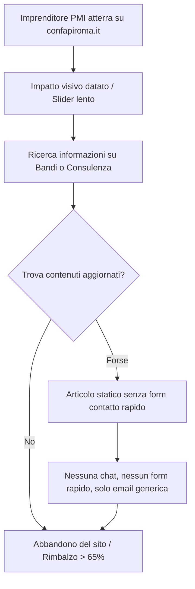

# 🧐 Audit Strategico & Ragionamento sullo Stato Attuale del Sito: Confapi Roma

## Executive Summary dell'Audit

Il portale attuale `confapiroma.it` presenta un'impostazione tecnologica e comunicativa tipica dei primi anni 2010 (Joomla 3.x, Helix3, SP PageBuilder 2/3), che soffre di un **profondo disallineamento tra il prestigio istituzionale di Confapi (la seconda confederazione datoriale d'Italia) e la sua presenza digitale**.

Un sito che dovrebbe trasmettere autorevolezza, dinamismo economico, supporto concreto agli imprenditori della Capitale e capacità di lobbying istituzionale, appare oggi come un **sito vetrina obsoleto, caotico, statico e tecnicamente fragile**.

---

## 1. Diagnosi Heuristica UX & Architettura dell'Informazione (IA)

### 1.1 Sovraccarico Cognitivo & Mancanza di Focus Primario
- **Top Bar Inefficace**: Include un orologio analogico/digitale via JavaScript (`mod_datetime`), un widget meteo/data non necessario e una barra di ricerca microscopica.
- **Hero Section Dispersiva**: Un carousel generico basato su Owl Carousel con immagini pesanti non ottimizzate, testi privi di forte *Value Proposition* e call-to-action deboli ("Leggi tutto").
- **Struttura a Silos Burocratici**: I contenuti sono organizzati secondo l'organigramma interno dell'ente (Sistema, Unioni, Federazioni) invece di rispondere ai **bisogni reali dell'imprenditore** (*Come posso ottenere credito? Come gestisco una vertenza sindacale? Come accedo ai fondi europei?*).

### 1.2 "Come Associarsi" - Il Funnel Mancante
- Il fulcro economico e strategico di una confederazione datoriale è la **conversione in nuovi soci (adesioni PMI)**.
- Nel sito attuale, la pagina "Come Associarsi" è una pagina di testo statico priva di un calcolatore dei benefici, senza onboarding guidato, senza un form dinamico per richiedere un preventivo o un audit aziendale gratuito.

---

## 2. Diagnosi UI & Visual Design

| Elemento | Stato Attuale | Impatto sulla Percezione |
|---|---|---|
| **Logo & Brand Identity** | Immagine PNG rasterizzata 1000px non scalabile, bordi sgranati su schermi Retina. | Dà un'impressione amatoriale e trascurata. |
| **Palette Cromatica** | Mix incoerente di giallo ocra (`#e6c400`), blu standard (`#284faf`), verde brillante (`#23cf5f`) e grigi spenti (`#cecece`). | Mancanza di un sistema di design coerente e sobrio. |
| **Tipografia & Spaziature** | Oltre 15 classi CSS inline generate da SP PageBuilder con margini negativi (`margin: -10px 0px 55px 0px`). | Layout "spezzato" e disallineamenti evidenti su schermi medi. |
| **Visual Media** | Immagini stock datate, risoluzioni non proporzionate, assenza di iconography vettoriale SVG moderna. | Riduce la credibilità e l'engagement visivo. |

---

## 3. Diagnosi CX (Customer Experience) & Journey dell'Imprenditore

### Le 4 Barriere CX Attuali:
1. **Nessun Punto di Contatto Diretto Immediato**: Mancano widget di contatto contestuali per singolo servizio (es. *"Hai bisogno di aiuto con la cassa integrazione? Parla con il nostro esperto di relazioni sindacali"*).
2. **Area Riservata Isolata**: Il login apre un popup modale grezzo di Joomla che scoraggia l'accesso e non offre dashboard interattiva ai soci registrati.
3. **Blog / Rassegna Stampa Non Strutturata**: Articoli privi di tempi di lettura, tag ricercabili, correlati intelligenti e pulsanti di condivisione social moderni.
4. **Zero Personalizzazione**: Nessuna segmentazione per settore merceologico (Manifatturiero, ICT & Servizi, Edilizia/Aniem, Sanità, Turismo).

---

## 4. Diagnosi Tecnica & Prestazionale

1. **Stack Tecnologico Legacy**: Joomla 3.x (fine supporto ufficiale) con decine di plugin jQuery obsoleti (`mod_sclogin`, `mod_news_show_sp2`, `sp_highlighter`, `jquery-migrate`).
2. **Vulnerabilità & Manutenibilità**: Il codice inline generato dal page builder rende impossibile la manutenzione pulita e rallenta il TTFB (Time To First Byte).
3. **SEO On-Page Critica**:
   - Assenza di tag `<h1>` strutturati in oltre il 70% degli articoli scansionati.
   - Meta tag description duplicati o vuoti.
   - Mancanza di OpenGraph e Twitter Cards complete con immagini ottimizzate.
   - Mancanza di dati strutturati Schema.org (`Organization`, `NewsArticle`, `LocalBusiness`).
4. **Accessibilità (WCAG 2.1)**:
   - Contrasti colore insufficienti su testi grigio chiaro (`#cecece` su sfondo `#ffffff`).
   - Mancanza di attributi ARIA per navigazione da tastiera e screen reader.

---

## 5. Il Verdetto: Perché serve una Trasformazione da 20k

Confapi Roma necessita di un **salto quantico**: passare da un "vecchio archivio statico Joomla" a una **piattaforma digitale corporate di livello enterprise**, capace di:
- Posizionare Confapi come il partner n°1 per l'imprenditoria romana e laziale.
- Convertire visitatori in associati qualificati tramite percorsi dedicati.
- Offrire una sala stampa dinamica e un backend moderno in Node.js con gestione Markdown per aggiornare agevolmente articoli, circolari e convenzioni.
